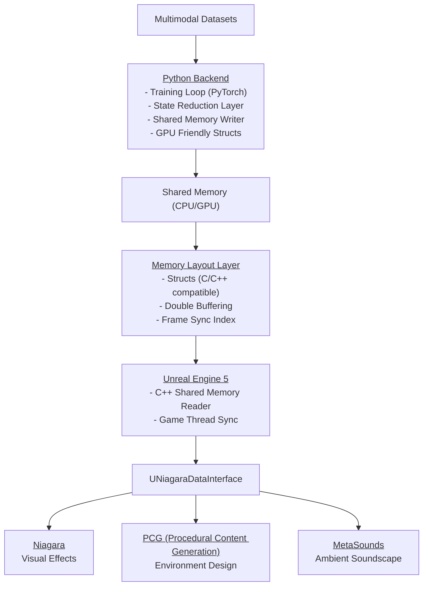

# 📘 Architecture Design Document

**Version:** 4.0 (April 26, 2026)  
**Project Name:** Versai  
**Genre:** Procedural Vibe / Ambience Training Simulator  
**Target Platform:** Windows 11 Pro (PC)  
**Engine:** Unreal Engine 5.7.4 + Python 3.14 + PyTorch 2.11 (hybrid)  
**Team:** Solo + Human-in-the-Loop (Dave) + Lead Dev (Grok)  
**Status:** MVP architecture locked (alpha local passed) -> Beta target: Steam Early Access

## UE5 Neural Training Visualization System (Single-Player GPU-Shared Memory Architecture)

---

# 1. System Overview

This system is a **local, single-player real-time neural training visualization engine** where:

* Python performs **training + simulation**
* UE5 performs **real-time rendering + interaction**
* Data flows through **shared memory (GPU-friendly buffers)**
* Visualization is powered by **Niagara + UNiagaraDataInterface**

---

# 2. MVP Scope (Locked for Beta)

MVP/Beta ships with:

* Single training model: `CausalLM`
* Single official Verse theme: `Cosmic Verse`
* Single official audio theme
* UI/HUD packs: `Light`, `Dark`, and `System`

Marketplace and model DLC systems are post-MVP.

---

# 3. Core Design Philosophy (IMPORTANT)

This system is NOT:

* a client/server architecture
* a distributed system
* a message broker system

This system IS:

> **a shared GPU-state simulation with multiple synchronized views**

---

# 4. High-Level Architecture



---

# 5. Core Data Flow

## 4.1 Write path (Python → UE)

1. Python training step runs
2. State is reduced into visualization-friendly format
3. Data written into **shared memory buffer A/B**
4. Frame index incremented

---

## 4.2 Read path (UE)

1. UE tick (frame update)
2. Reads latest completed frame from shared memory
3. Passes structured data into:

   * Niagara system
   * Material graphs
   * Instanced meshes

---

# 6. Critical Upgrade: Data Reduction Layer

This is the MOST important part of the entire system.

You must NOT pass raw ML data to UE.

---

## 5.1 Transformation pipeline

```text id="v3_reduce_01"
Raw Tensor Data
      ↓
Feature Extraction Layer
      ↓
Visualization Mapping Layer
      ↓
GPU-Friendly Structs
      ↓
Shared Memory Buffer
```

---

## 5.2 Example output structure

```cpp id="v3_struct_01"
struct NeuronViz {
    int id;
    float activation;
    float x, y, z;
};

struct ConnectionViz {
    int from;
    int to;
    float weight;
};

struct LayerFrame {
    int frame_id;
    int layer_id;
    int neuron_count;
    int connection_count;
};

struct VisGenPCG {
    vector<float> position;
    float density;
    float gradiant_mag;
}
```

---

# 7. Shared Memory Design (CRITICAL)

## 6.1 Requirements

* Lock-free or double-buffered
* Cache-aligned structs
* Fixed-size buffers (NO dynamic allocation)

---

## 6.2 Double buffering

```text id="v3_buffer_01"
Buffer A (write)
Buffer B (read)

Swap each frame
```

---

## 6.3 Frame synchronization

```cpp id="v3_sync_01"
struct FrameHeader {
    uint64_t frame_id;
    uint32_t buffer_index;
    bool ready;
};
```

UE only reads frames where:

* `ready == true`
* `frame_id > last_frame`

---

# 8. Python Backend (v3 architecture)

## 7.1 Stack

* PyTorch (training)
* NumPy (intermediate transforms)
* multiprocessing.shared_memory (IPC)
* optional: CUDA pinned buffers

---

## 7.2 Core loop

```python id="v3_py_01"
while training:
    loss = train_step()

    viz_data = reduce_model_state(model)

    shared_buffer.write(viz_data)

    shared_buffer.frame_id += 1
    shared_buffer.ready = True
```

---

## 7.3 Key optimization

### DO NOT:

* allocate per step
* serialize JSON
* copy full tensors

### DO:

* reuse buffers
* write into preallocated memory
* use numpy views over shared memory

---

# 9. Unreal Engine 5 Architecture

## 8.1 Components

* SharedMemoryReader (C++)
* FrameSyncManager
* Niagara System (UNiagaraDataInterface)
* Niagara Particle Effects System
* Procedural Content Generation (PCG)
* MetaSounds

---

## 8.2 Frame tick model

```cpp id="v3_ue_tick"
void Tick(float DeltaTime)
{
    FrameData data = SharedMemory.ReadLatestFrame();

    if (data.frame_id != last_frame_id)
    {
        UpdateNiagara(data);
        last_frame_id = data.frame_id;
    }
}
```

---

# 10. NDI-Based Verse Integration (PCG + Niagara + MetaSounds)

This is where your system becomes visually powerful.

---

## 9.1 Role of Niagara

Niagara handles:

* GPU particle simulation
* neuron visualization
* connection rendering
* dynamic graph layout

---

## 9.2 UNiagaraDataInterface usage

You will feed:

* neuron buffers
* activation values
* edge weights

directly into GPU particles.

---

## 9.3 Ideal mapping

| ML concept | PCG Representation         | Niagara representation |
| ---------- | ---------------------------|----------------------- |
| Neuron     | PCG Point + attributes     | particle               |
| Activation | Density / Scale Attribute  | color/brightness       |
| Weight     | Spline Thickness / tension | line thickness         |
| Layer      | PCG Volume / Layer Group   | emitter system         |

---

# 11. Optional Systems (Recommended NOW)

Even though you're early, add these now:

---

## 10.1 Debug visualization mode

* CPU fallback renderer
* simple mesh visualization
* for validating correctness

---

## 10.2 Frame recorder

Store:

* shared memory snapshots
* replay training sessions

This becomes your “training playback system”

---

## 10.3 Deterministic mode toggle

Ensure reproducibility:

* fixed seed training
* locked frame stepping

---

# 12. Performance Model

## Target constraints:

| System              | Target                   |
| ------------------- | ------------------------ |
| Python loop         | async-safe, non-blocking |
| Shared memory write | < 1 ms                   |
| UE frame read       | < 0.5 ms                 |
| Niagara update      | GPU-bound only           |

---

# 13. What we explicitly REMOVED in v3

Because you're now single-player:

### Removed:

* MQTT
* WebSockets
* FastAPI server layer
* network serialization stack

These were unnecessary overhead.

---

# 14. Final System Summary

```text id="v3_final_01"
Python = Brain (training + simulation)
Shared Memory = Nervous system (state transfer)
UE5 = Visual cortex (rendering + interaction)
Niagara = GPU visual interpreter
```

---

# 15. Key Design Principles (DO NOT BREAK THESE)

## 1. UE never owns truth

Shared memory is the source of truth.

---

## 2. Python never blocks rendering

Training and rendering are fully decoupled.

---

## 3. Everything is frame-based

No event-driven logic for visuals.

---

## 4. Zero dynamic allocations in hot path

Preallocate everything.

---

# 16. Recommended Build Order (IMPORTANT)

Since you're still in scaffolding stage:

### Phase 1

* Shared memory layout
* Frame sync system
* Python writer stub

### Phase 2

* UE reader (basic logging first)
* Frame validation

### Phase 3

* UNiagaraDataInterface integration
* Connect to Niagara, PCG, SoundScape

### Phase 4

* Full neural visualization mapping and testing

---
